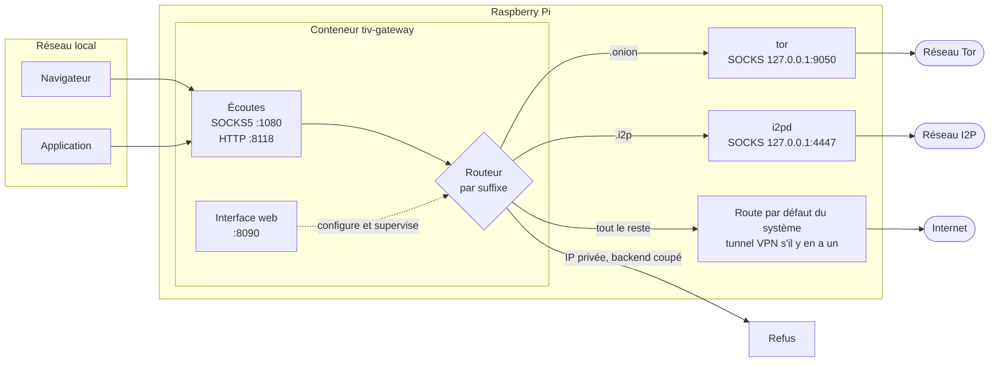
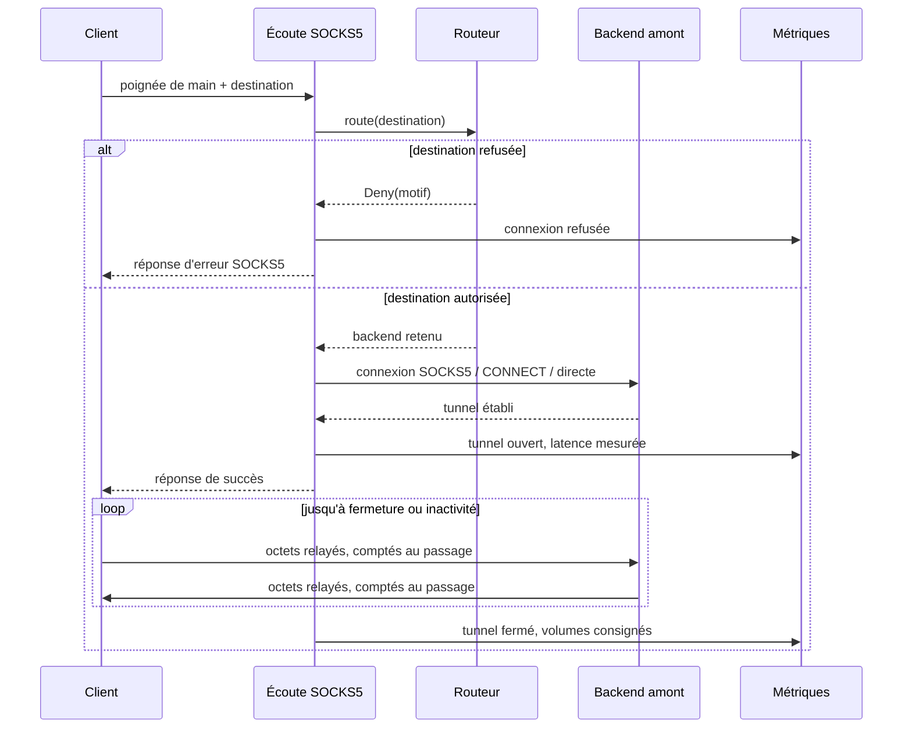
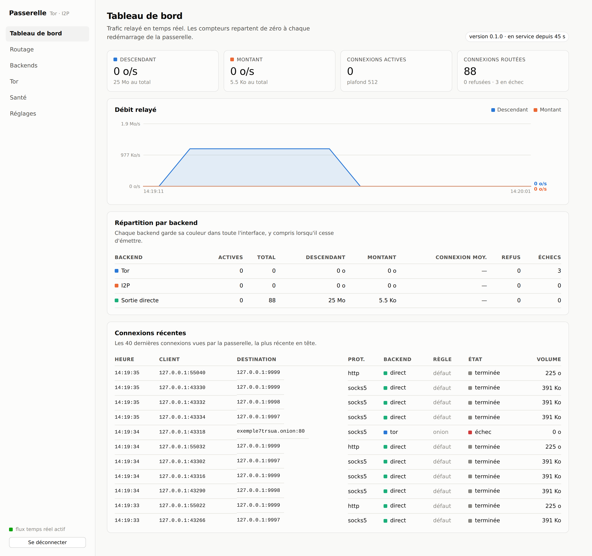
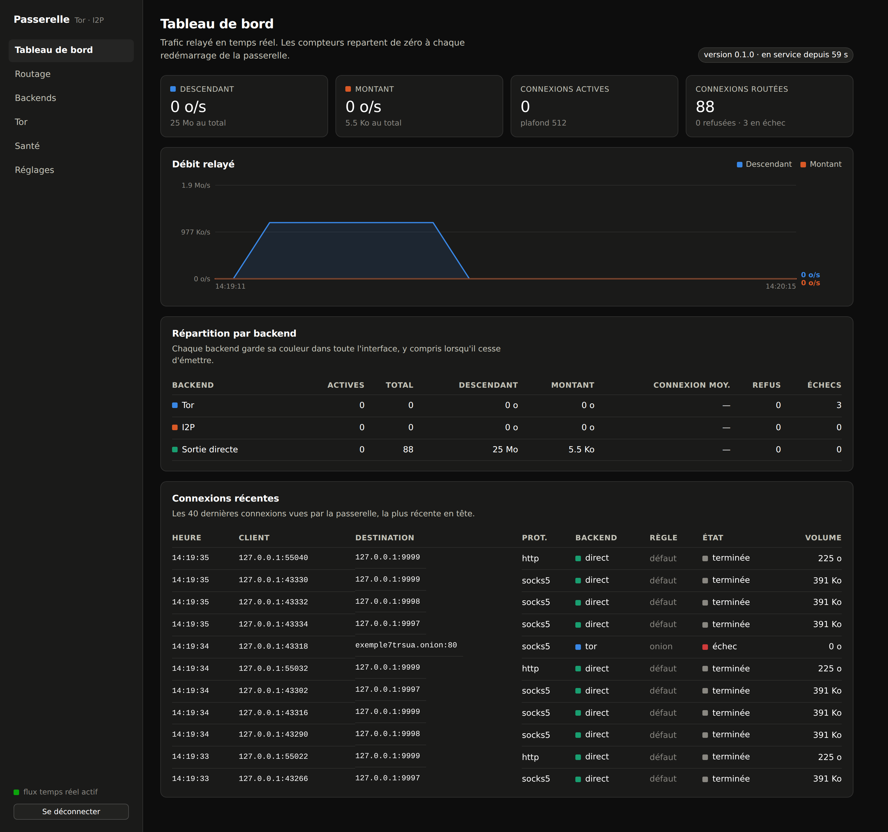
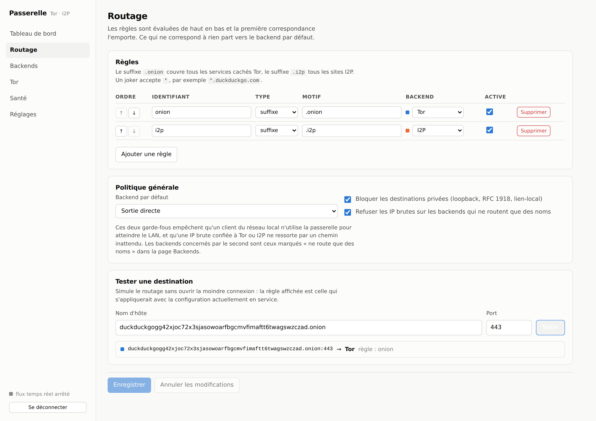
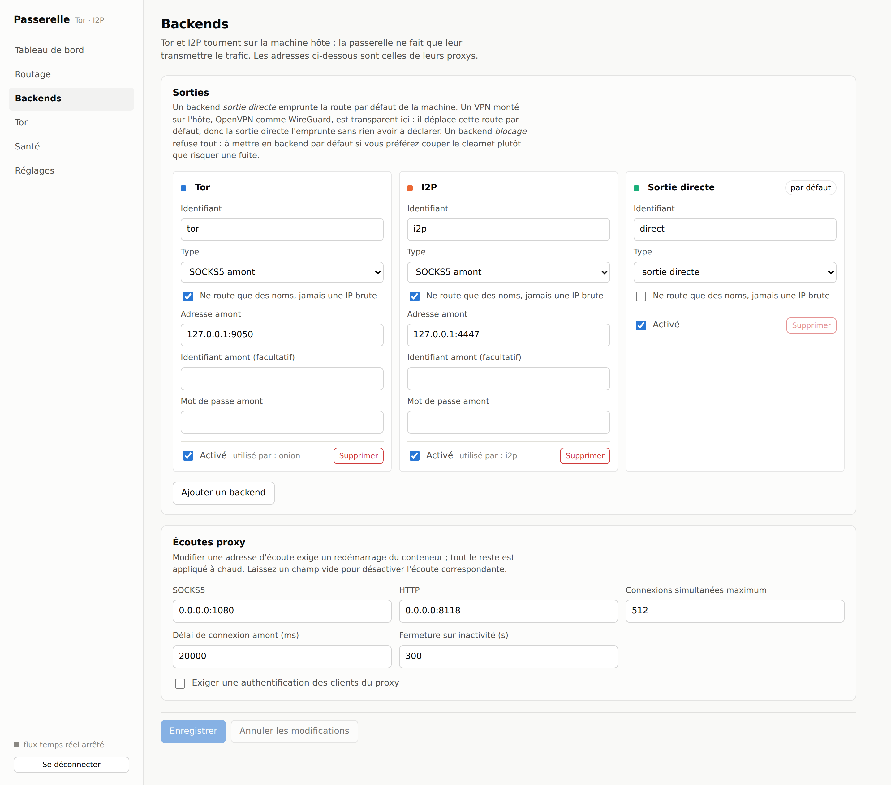
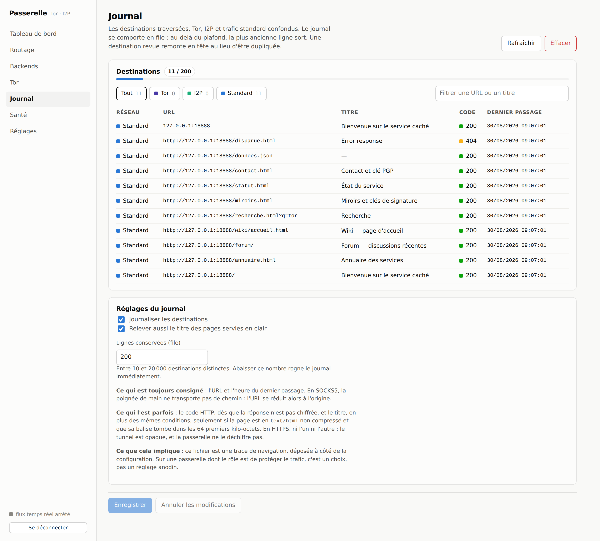
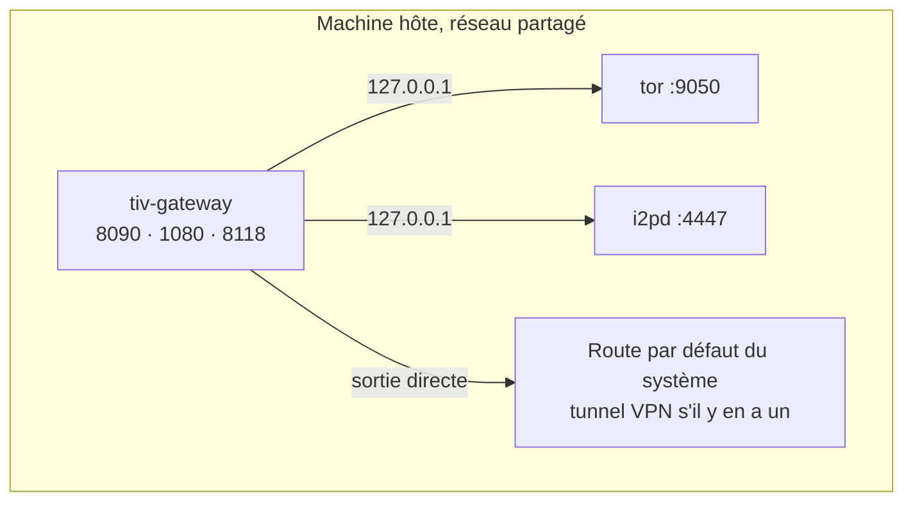

# Passerelle Tor / I2P

Un unique proxy SOCKS5 et HTTP pour tout le réseau local, qui aiguille chaque
connexion selon le nom de domaine demandé : les adresses `.onion` partent vers
Tor, les `.i2p` vers I2P, le reste sort directement. Une interface web sert à
écrire les règles de routage et à surveiller ce qui sort réellement.

Le tout est un binaire Rust unique — dataplane, API et interface comprise —
pensé pour un Raspberry Pi sous CasaOS.

> **Prérequis** : Tor et I2P sont installés et démarrés **sur la machine hôte**.
> La passerelle ne les embarque pas, elle leur transmet le trafic.

Trois issues possibles, et rien d'autre à déclarer : **Tor**, **I2P**, ou la
**sortie normale** de la machine. Un tunnel monté sur l'hôte — OpenVPN,
WireGuard — n'apparaît nulle part dans la configuration : il déplace la route
par défaut du système, donc la sortie directe l'emprunte d'elle-même. Comme rien
ne signale sa chute, ce sont les [sondes de santé](#garde-fous) qui la
détectent.

## Ce que ça fait



Configurez une seule fois vos clients sur `IP_DU_PI:1080` en SOCKS5, et ils
atteignent Tor et I2P sans rien savoir de cette répartition.

### Établissement d'une connexion



Les noms d'hôte sont transmis tels quels au proxy amont : c'est Tor ou I2P qui
les résout, à l'intérieur de son propre réseau. Aucune requête DNS ne part de la
passerelle pour une destination cachée.

## L'interface web

Les captures ci-dessous sont prises sur une passerelle réellement en marche ;
les chiffres viennent du trafic qui la traversait au moment de la prise de vue.

### Tableau de bord

Débit montant et descendant en temps réel, répartition par backend, journal des
connexions avec leur destination, la règle appliquée et le volume échangé.



L'interface suit le thème du système, et le thème sombre est choisi pas à pas
plutôt qu'inversé automatiquement :



### Routage

Les règles s'ordonnent par priorité, et le simulateur répond « où partirait ce
nom d'hôte ? » sans ouvrir la moindre connexion :



### Backends

Adresses des proxys Tor et I2P sur l'hôte, type de sortie, écoutes offertes au
réseau local :



### Journal

Facultatif, et coupé par défaut. Une fois activé, il retient les destinations
traversées avec leur code HTTP et, quand la page est servie en clair, son titre.
Le plafond se règle sur place : au-delà, la plus ancienne ligne sort.



Cette capture vient d'une passerelle d'essai dont le trafic est local, faute de
démon Tor ou I2P sur la machine de développement : les compteurs Tor et I2P y
sont donc à zéro, mais le mécanisme montré est exactement le même.

Ce qui est **toujours** consigné : l'URL et l'heure du dernier passage. Ce qui
ne l'est **que parfois** : le code HTTP, dès lors que la réponse n'est pas
chiffrée, et le titre, aux mêmes conditions plus `text/html` non compressé dans
les 64 premiers kilo-octets. En HTTPS, ni l'un ni l'autre — le tunnel est
opaque, et la passerelle ne le déchiffre pas ; en SOCKS5, la poignée de main ne
transporte pas de chemin, l'URL se réduit alors à l'origine.

Il n'y a pas de base SQL derrière : `catalogue.jsonl` vit à côté de
`config.toml`, une ligne par destination, relu au démarrage et compacté quand il
se remplit de lignes périmées. Deux colonnes utiles et quelques milliers de
lignes ne justifient pas d'embarquer l'amalgame C de SQLite dans une image
qu'on compile en croisé pour ARM.

### Toutes les pages

| Page | Ce qu'on y fait |
|---|---|
| **Tableau de bord** | Débit montant et descendant en temps réel, répartition par backend, journal des connexions récentes avec leur destination, leur règle et leur volume. |
| **Routage** | Écriture des règles, réordonnancement par priorité, garde-fous de sécurité, et un simulateur qui répond « où partirait ce nom d'hôte ? » sans ouvrir la moindre connexion. |
| **Backends** | Adresses des proxys Tor et I2P, type de sortie, écoutes proposées au réseau local, authentification éventuelle des clients. |
| **Tor** | Version et phase d'amorçage du démon, liste des circuits et de leurs relais, demande de nouvelle identité, fermeture d'un circuit. |
| **Journal** | Destinations traversées — Tor, I2P et trafic standard — avec leur code HTTP, le titre de la page quand il est lisible, et le plafond de lignes conservées. Désactivé par défaut. |
| **Santé** | Résultat des sondes de sortie : IP publique vue par chaque backend, confirmation que Tor est bien emprunté, détection d'un VPN d'hôte tombé. |
| **Réglages** | Mot de passe administrateur, durée des sessions, export Prometheus. |

Le flux de métriques arrive en Server-Sent Events : le tableau de bord se met à
jour sans que le navigateur n'interroge quoi que ce soit.

## Installation sous CasaOS

### 1. Préparer l'hôte

Tor et I2P doivent tourner et écouter en local :

```bash
sudo apt install tor i2pd

# /etc/tor/torrc — le ControlPort est facultatif, il n'est utile qu'à la page Tor
sudo tee -a /etc/tor/torrc <<'EOF'
SocksPort 127.0.0.1:9050
ControlPort 127.0.0.1:9051
CookieAuthentication 1
EOF

sudo systemctl restart tor i2pd
```

i2pd expose par défaut un proxy SOCKS sur `127.0.0.1:4447` et un proxy HTTP sur
`127.0.0.1:4444` ; les deux conviennent.

### 2. Préparer le volume de données

Le conteneur tourne sans privilège, avec l'UID 1000 :

```bash
sudo mkdir -p /DATA/AppData/tiv-gateway
sudo chown -R 1000:1000 /DATA/AppData/tiv-gateway
```

### 3. Démarrer

```bash
TIV_ADMIN_PASSWORD='un-mot-de-passe-solide' docker compose up -d
```

Puis ouvrez `http://IP_DU_PI:8090`. Sans `TIV_ADMIN_PASSWORD`, le premier écran
vous demande de créer le mot de passe administrateur ; tant qu'il n'existe pas,
l'API refuse tout le reste.

Dans CasaOS, le `docker-compose.yml` s'importe tel quel depuis
*App Store → Custom Install* : il porte les métadonnées `x-casaos` (icône,
catégorie, port de l'interface).

## Image de conteneur

L'image est publiée sur le registre GitHub, pour `linux/amd64` et
`linux/arm64` — c'est cette dernière qui tourne sur un Raspberry Pi 64 bits :

```bash
docker pull ghcr.io/venantvr-security/tor.i2p.vpn:latest
```

Étiquettes disponibles : `latest` suit la branche par défaut, `sha-xxxxxxx`
épingle un commit, et une version posée en tag `v1.2.3` publie `1.2.3` et `1.2`.

Le workflow [`image.yml`](.github/workflows/image.yml) vérifie le formatage,
clippy et les tests sur toutes les branches, puis construit l'interface. La
publication, elle, n'a lieu que depuis la branche par défaut, sur un tag `v*`,
ou à la demande depuis l'onglet Actions.

Le paquet est public : le dépôt l'étant, la visibilité a été héritée à la
première publication, et l'image se récupère sans authentification. Si un jour
un paquet ressortait privé — c'est le cas lorsqu'il est produit depuis un dépôt
privé —, la bascule se fait à la main dans
*Packages → tor.i2p.vpn → Package settings → Change visibility*, aucune API ne
la pilotant.

### Construire l'image soi-même

```bash
docker buildx build --platform linux/arm64 -t tiv-gateway:local .
```

La compilation Rust tourne sur l'architecture de votre machine et produit du
code pour l'architecture cible : un build ARM64 depuis un PC prend une minute et
demie au lieu de la demi-heure qu'imposerait l'émulation du compilateur.

### Pourquoi le réseau de l'hôte



`network_mode: host` est le moyen le plus simple d'atteindre `127.0.0.1:9050` et
d'emprunter réellement la route par défaut de la machine — VPN compris, ce qui
rend les sondes de santé honnêtes. Une variante en réseau bridge est fournie en commentaire dans le
`docker-compose.yml` ; il faut alors viser `host.docker.internal` depuis la page
« Backends ».

## Configuration

Tout se règle depuis l'interface web, qui écrit `/data/config.toml`. Hormis les
adresses d'écoute, les changements sont appliqués à chaud, sans redémarrage :
la configuration est publiée derrière un `ArcSwap` que le dataplane relit à
chaque nouvelle connexion.

Le fichier [`config.example.toml`](config.example.toml) documente chaque champ.

### Variables d'environnement

| Variable | Rôle |
|---|---|
| `TIV_CONFIG` | Chemin du fichier de configuration. Défaut : `/data/config.toml`. |
| `TIV_ADMIN_PASSWORD` | Mot de passe administrateur créé au tout premier démarrage. Ignoré ensuite. |
| `TIV_LOG` | Filtre de journalisation, syntaxe `tracing`. Défaut : `info`. |

## Garde-fous

La passerelle décide du chemin qu'emprunte le trafic de quelqu'un : elle refuse
plutôt que de laisser fuiter.

- **Destinations privées bloquées.** Loopback, RFC 1918 et lien-local sont
  refusés, y compris lorsqu'un nom public y résout : la vérification est refaite
  *après* la résolution DNS, pour que le DNS ne devienne pas un contournement.
- **IP brutes refusées sur Tor et I2P.** Ces réseaux résolvent les noms dans leur
  tunnel ; une IP nue en ressortirait ailleurs.
- **Sortie de secours `block`.** Un backend qui refuse tout. Mettez-le en backend
  par défaut pour une passerelle strictement Tor et I2P, qui coupe le reste
  plutôt que de risquer une fuite pendant qu'un tunnel est tombé.
- **Sondes de sortie.** Elles comparent l'IP publique vue par chaque backend. Un
  tunnel monté sur l'hôte est invisible pour la passerelle et ne signale rien
  quand il tombe : renseignez `unexpected_exit_ip` avec l'adresse de votre lien
  nu, et l'alerte est levée en critique dès que la sortie directe y débouche.
  Idem si un backend anonymisant partage son adresse de sortie avec elle.
- **Administration protégée.** Mot de passe haché en Argon2id, session signée en
  HMAC dans un cookie `HttpOnly` `SameSite=Strict`, temporisation exponentielle
  après cinq échecs de connexion, comparaisons en temps constant.
- **Conteneur sans privilège.** UID 1000, `cap_drop: ALL`, système de fichiers en
  lecture seule, `no-new-privileges`.

`BIND` et `UDP ASSOCIATE` ne sont volontairement pas implémentés : ils n'ont
aucun sens pour Tor ou I2P et ouvriraient un chemin de fuite sur le clearnet.

## Modèle de connexion

Une connexion cliente donne une connexion amont, sans mise en commun. Ce n'est
pas un oubli : une connexion SOCKS5 est liée à sa destination dès la poignée de
main, si bien qu'une fois le tunnel fermé la socket n'est plus réutilisable pour
rien. Un pool amont n'aurait donc rien à mettre en cache.

Mesuré sur boucle locale, en profil release, 200 requêtes séquentielles :

| chemin | par requête |
|---|---|
| direct, sans passerelle | 0,614 ms |
| à travers l'écoute SOCKS5 | 0,870 ms |
| à travers l'écoute HTTP | 0,766 ms |

Le surcoût de la passerelle est donc de l'ordre de 0,2 ms par connexion, à
comparer aux 100 ms à 2 s que coûte l'établissement d'un circuit Tor. Pré-ouvrir
des connexions vers `127.0.0.1:9050` optimiserait deux centièmes de pour cent de
la dépense.

Côté client, en revanche, la persistance est intégralement préservée : la
passerelle relaie des octets sans les interpréter, donc un navigateur qui ouvre
un tunnel SOCKS5 y fait son keep-alive HTTP/1.1 ou HTTP/2 comme il l'entend, et
un `CONNECT` reste ouvert aussi longtemps que le client le souhaite. Seule
l'écoute HTTP en URI absolue — donc du HTTP en clair, pas HTTPS — sert une
requête par connexion : y faire du keep-alive obligerait à analyser les corps de
réponse pour savoir où chacune s'arrête, c'est-à-dire à poser un parseur HTTP
complet sur le trafic, avec les risques de *request smuggling* correspondants.

## Développement

```bash
# Interface, avec rechargement à chaud, proxifiée vers l'API locale
npm --prefix web install
npm --prefix web run dev

# Passerelle
cargo run

# Vérifications
cargo test
cargo clippy --all-targets
```

`cargo run` embarque le contenu de `web/dist` dans le binaire : lancez
`npm --prefix web run build` avant de compiler pour servir l'interface depuis le
binaire lui-même. Sans ce build, l'API fonctionne et une page d'explication
remplace l'interface.

### Structure

```
src/
├── main.rs          point d'entrée, tâches de fond, arrêt propre
├── config.rs        modèle de configuration, validation, masquage des secrets
├── routing.rs       moteur de règles et garde-fous de destination
├── state.rs         état partagé, bascule à chaud, plafond de connexions
├── metrics.rs       compteurs atomiques, série de débit, journal des connexions
├── health.rs        sondes de sortie et analyse des fuites
├── tor_control.rs   client du ControlPort de Tor
├── auth.rs          Argon2id, jetons de session, anti-force-brute
├── proxy/           écoutes SOCKS5 et HTTP, amont, relais
└── web/             API JSON, flux SSE, service de la SPA
web/                 interface Vue 3
```

### API

Toutes les routes sont sous `/api` et exigent le cookie de session, hormis
`/api/session`, `/api/login` et `/api/setup`.

| Route | Rôle |
|---|---|
| `GET /api/status` | Version, écoutes, backends configurés. |
| `GET /api/metrics` | Instantané complet : compteurs, série de débit, journal. |
| `GET /api/stream` | Même instantané poussé en SSE toutes les deux secondes. |
| `GET·PUT /api/config` | Lecture et enregistrement de la configuration. |
| `POST /api/routing/test` | Simulation de routage pour un couple hôte/port. |
| `GET·DELETE /api/catalogue` | Journal des destinations, et son effacement. |
| `GET /api/tor`, `POST /api/tor/newnym` | État des circuits, nouvelle identité. |
| `GET /api/health`, `POST /api/health/run` | Sondes de sortie. |
| `GET /api/metrics/prometheus` | Exposition Prometheus des mêmes compteurs. |

## Licence

MIT.
