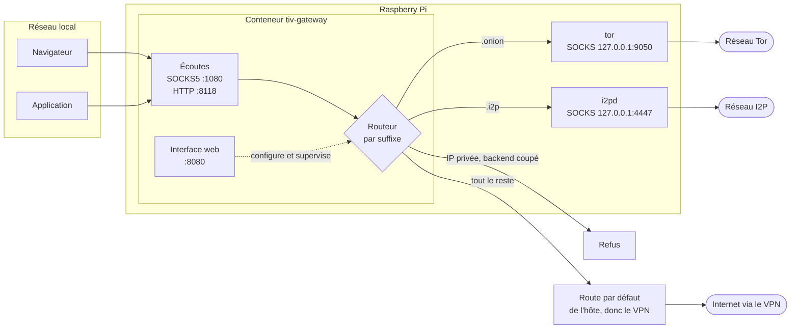
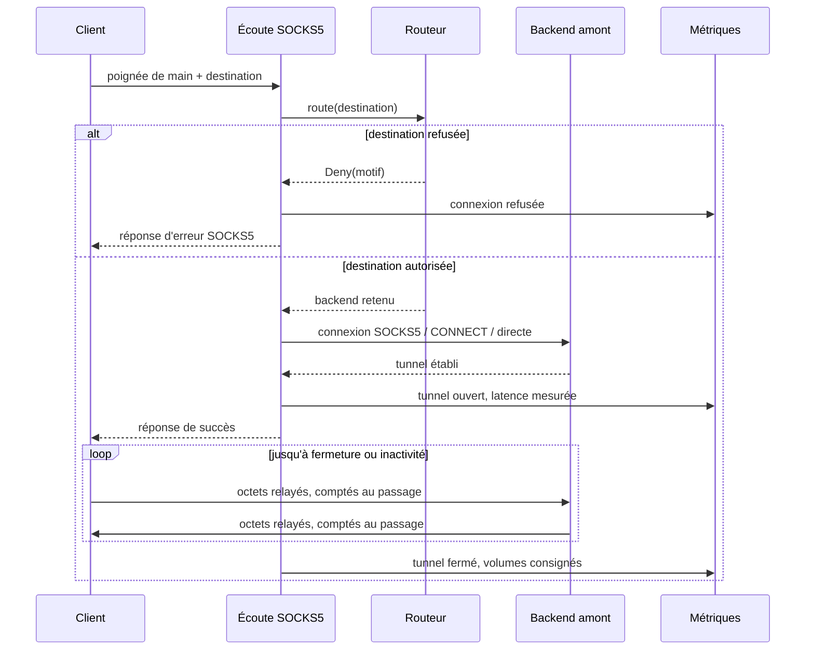
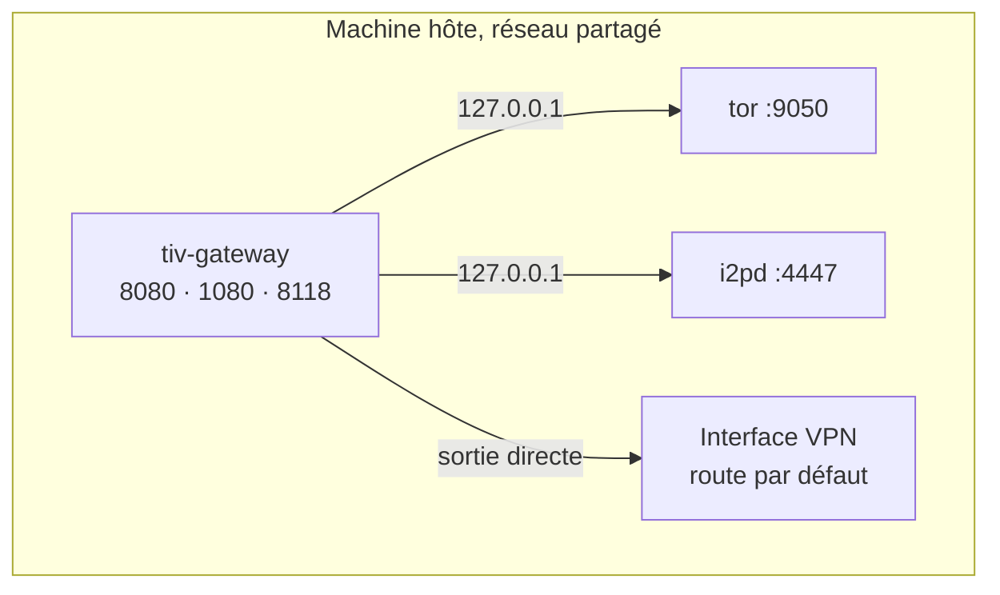

# Passerelle Tor / I2P / VPN

Un unique proxy SOCKS5 et HTTP pour tout le réseau local, qui aiguille chaque
connexion selon le nom de domaine demandé : les adresses `.onion` partent vers
Tor, les `.i2p` vers I2P, et tout le reste emprunte le VPN. Une interface web
sert à écrire les règles de routage et à surveiller ce qui sort réellement.

Le tout est un binaire Rust unique — dataplane, API et interface comprise —
pensé pour un Raspberry Pi sous CasaOS.

> **Prérequis** : Tor et I2P sont installés et démarrés **sur la machine hôte**.
> La passerelle ne les embarque pas, elle leur transmet le trafic.

## Ce que ça fait



Configurez une seule fois vos clients sur `IP_DU_PI:1080` en SOCKS5, et ils
atteignent les trois réseaux sans rien savoir de cette répartition.

### Établissement d'une connexion



Les noms d'hôte sont transmis tels quels au proxy amont : c'est Tor ou I2P qui
les résout, à l'intérieur de son propre réseau. Aucune requête DNS ne part de la
passerelle pour une destination cachée.

## L'interface web

| Page | Ce qu'on y fait |
|---|---|
| **Tableau de bord** | Débit montant et descendant en temps réel, répartition par backend, journal des connexions récentes avec leur destination, leur règle et leur volume. |
| **Routage** | Écriture des règles, réordonnancement par priorité, garde-fous de sécurité, et un simulateur qui répond « où partirait ce nom d'hôte ? » sans ouvrir la moindre connexion. |
| **Backends** | Adresses des proxys Tor et I2P, type de sortie, écoutes proposées au réseau local, authentification éventuelle des clients. |
| **Tor** | Version et phase d'amorçage du démon, liste des circuits et de leurs relais, demande de nouvelle identité, fermeture d'un circuit. |
| **Santé** | Résultat des sondes de sortie : IP publique vue par chaque backend, confirmation que Tor est bien emprunté, détection d'un VPN tombé. |
| **Réglages** | Mot de passe administrateur, durée des sessions, export Prometheus. |

Le flux de métriques arrive en Server-Sent Events : le tableau de bord se met à
jour sans que le navigateur n'interroge quoi que ce soit.

## Installation sous CasaOS

### 1. Préparer l'hôte

Tor et I2P doivent tourner et écouter en local :

```bash
sudo apt install tor i2pd

# /etc/tor/torrc — le ControlPort est facultatif, il n'est utile qu'à la page Tor
sudo tee -a /etc/tor/torrc <<'EOF'
SocksPort 127.0.0.1:9050
ControlPort 127.0.0.1:9051
CookieAuthentication 1
EOF

sudo systemctl restart tor i2pd
```

i2pd expose par défaut un proxy SOCKS sur `127.0.0.1:4447` et un proxy HTTP sur
`127.0.0.1:4444` ; les deux conviennent.

### 2. Préparer le volume de données

Le conteneur tourne sans privilège, avec l'UID 1000 :

```bash
sudo mkdir -p /DATA/AppData/tiv-gateway
sudo chown -R 1000:1000 /DATA/AppData/tiv-gateway
```

### 3. Démarrer

```bash
TIV_ADMIN_PASSWORD='un-mot-de-passe-solide' docker compose up -d
```

Puis ouvrez `http://IP_DU_PI:8080`. Sans `TIV_ADMIN_PASSWORD`, le premier écran
vous demande de créer le mot de passe administrateur ; tant qu'il n'existe pas,
l'API refuse tout le reste.

Dans CasaOS, le `docker-compose.yml` s'importe tel quel depuis
*App Store → Custom Install* : il porte les métadonnées `x-casaos` (icône,
catégorie, port de l'interface).

### Pourquoi le réseau de l'hôte



`network_mode: host` est le moyen le plus simple d'atteindre `127.0.0.1:9050` et
d'emprunter réellement la route VPN de la machine — ce qui rend les sondes de
santé honnêtes. Une variante en réseau bridge est fournie en commentaire dans le
`docker-compose.yml` ; il faut alors viser `host.docker.internal` depuis la page
« Backends ».

## Configuration

Tout se règle depuis l'interface web, qui écrit `/data/config.toml`. Hormis les
adresses d'écoute, les changements sont appliqués à chaud, sans redémarrage :
la configuration est publiée derrière un `ArcSwap` que le dataplane relit à
chaque nouvelle connexion.

Le fichier [`config.example.toml`](config.example.toml) documente chaque champ.

### Variables d'environnement

| Variable | Rôle |
|---|---|
| `TIV_CONFIG` | Chemin du fichier de configuration. Défaut : `/data/config.toml`. |
| `TIV_ADMIN_PASSWORD` | Mot de passe administrateur créé au tout premier démarrage. Ignoré ensuite. |
| `TIV_LOG` | Filtre de journalisation, syntaxe `tracing`. Défaut : `info`. |

## Garde-fous

La passerelle décide du chemin qu'emprunte le trafic de quelqu'un : elle refuse
plutôt que de laisser fuiter.

- **Destinations privées bloquées.** Loopback, RFC 1918 et lien-local sont
  refusés, y compris lorsqu'un nom public y résout : la vérification est refaite
  *après* la résolution DNS, pour que le DNS ne devienne pas un contournement.
- **IP brutes refusées sur Tor et I2P.** Ces réseaux résolvent les noms dans leur
  tunnel ; une IP nue en ressortirait ailleurs.
- **Sortie de secours `block`.** Un backend qui refuse tout, à mettre par défaut
  si vous préférez couper le clearnet plutôt que risquer une fuite pendant que le
  VPN est tombé.
- **Sondes de sortie.** Elles comparent l'IP publique vue par chaque backend :
  si le chemin clearnet ressort sur l'IP nue du FAI, ou si Tor et le clearnet
  partagent la même sortie, l'alerte est levée en critique.
- **Administration protégée.** Mot de passe haché en Argon2id, session signée en
  HMAC dans un cookie `HttpOnly` `SameSite=Strict`, temporisation exponentielle
  après cinq échecs de connexion, comparaisons en temps constant.
- **Conteneur sans privilège.** UID 1000, `cap_drop: ALL`, système de fichiers en
  lecture seule, `no-new-privileges`.

`BIND` et `UDP ASSOCIATE` ne sont volontairement pas implémentés : ils n'ont
aucun sens pour Tor ou I2P et ouvriraient un chemin de fuite sur le clearnet.

## Développement

```bash
# Interface, avec rechargement à chaud, proxifiée vers l'API locale
npm --prefix web install
npm --prefix web run dev

# Passerelle
cargo run

# Vérifications
cargo test
cargo clippy --all-targets
```

`cargo run` embarque le contenu de `web/dist` dans le binaire : lancez
`npm --prefix web run build` avant de compiler pour servir l'interface depuis le
binaire lui-même. Sans ce build, l'API fonctionne et une page d'explication
remplace l'interface.

### Structure

```
src/
├── main.rs          point d'entrée, tâches de fond, arrêt propre
├── config.rs        modèle de configuration, validation, masquage des secrets
├── routing.rs       moteur de règles et garde-fous de destination
├── state.rs         état partagé, bascule à chaud, plafond de connexions
├── metrics.rs       compteurs atomiques, série de débit, journal des connexions
├── health.rs        sondes de sortie et analyse des fuites
├── tor_control.rs   client du ControlPort de Tor
├── auth.rs          Argon2id, jetons de session, anti-force-brute
├── proxy/           écoutes SOCKS5 et HTTP, amont, relais
└── web/             API JSON, flux SSE, service de la SPA
web/                 interface Vue 3
```

### API

Toutes les routes sont sous `/api` et exigent le cookie de session, hormis
`/api/session`, `/api/login` et `/api/setup`.

| Route | Rôle |
|---|---|
| `GET /api/status` | Version, écoutes, backends configurés. |
| `GET /api/metrics` | Instantané complet : compteurs, série de débit, journal. |
| `GET /api/stream` | Même instantané poussé en SSE toutes les deux secondes. |
| `GET·PUT /api/config` | Lecture et enregistrement de la configuration. |
| `POST /api/routing/test` | Simulation de routage pour un couple hôte/port. |
| `GET /api/tor`, `POST /api/tor/newnym` | État des circuits, nouvelle identité. |
| `GET /api/health`, `POST /api/health/run` | Sondes de sortie. |
| `GET /api/metrics/prometheus` | Exposition Prometheus des mêmes compteurs. |

## Licence

MIT.
