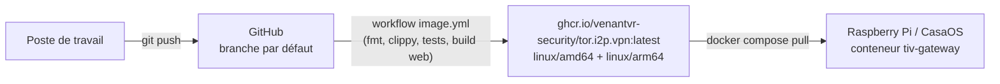

# Déploiement et mise à jour sous CasaOS

Ce document décrit la chaîne de déploiement réelle de la passerelle sur un
Raspberry Pi sous CasaOS : où vit l'application, d'où vient l'image, et la
procédure exacte de mise à jour. L'installation initiale (prérequis Tor et
I2P sur l'hôte, création du volume) est décrite dans le
[README](../README.md#installation-sous-casaos).

## La chaîne, de bout en bout

Rien ne se compile sur le Pi : l'image est construite par l'intégration
continue et le Pi ne fait que la tirer.



Le workflow [`image.yml`](../.github/workflows/image.yml) vérifie le code sur
toutes les branches mais ne publie l'image que depuis la branche par défaut,
un tag `v*`, ou un déclenchement manuel. Un push accepté sur la branche par
défaut suffit donc à rendre une mise à jour disponible ; comptez deux à trois
minutes de construction.

## Où vit l'application sur le Pi

L'application a été installée en important le
[`docker-compose.yml`](../docker-compose.yml) du dépôt via
*App Store → Custom Install*. CasaOS en garde sa propre copie — c'est elle qui
fait foi, pas le clone éventuel du dépôt sur la machine :

| Chemin | Rôle |
|---|---|
| `/var/lib/casaos/apps/tiv-gateway/docker-compose.yml` | Le compose importé, propriété de CasaOS. Toute commande `docker compose` se lance depuis ce dossier. |
| `/DATA/AppData/tiv-gateway/config.toml` | La configuration persistante, montée sur `/data` : règles de routage, backends, mot de passe administrateur haché. |

Le conteneur s'appelle `tiv-gateway`, tourne en `network_mode: host` (pour
atteindre les proxys Tor et I2P de l'hôte) et redémarre seul
(`restart: unless-stopped`).

## Mettre à jour

```bash
sudo sh -c 'cd /var/lib/casaos/apps/tiv-gateway && docker compose pull && docker compose up -d'
```

C'est tout. `pull` tire le nouveau `latest` depuis le registre GitHub, `up -d`
ne recrée le conteneur que si l'image a changé.

La recréation ne perd rien : le `config.toml` — mot de passe administrateur
compris — vit dans le volume, pas dans le conteneur. Les compteurs de trafic,
eux, repartent de zéro, comme à chaque redémarrage.

## Vérifier ce qui tourne

Chaque image porte en étiquette le commit exact dont elle est issue :

```bash
sudo docker inspect tiv-gateway --format \
  '{{.State.Health.Status}} — {{index .Config.Labels "org.opencontainers.image.revision"}}'
# healthy — c27b889d86515846cb52dda03edac2f615c77496
```

Si la révision affichée n'est pas celle attendue, c'est que la CI n'avait pas
fini de publier au moment du `pull` : vérifiez le dernier passage du workflow
(`gh run list`, ou l'onglet Actions), puis relancez la mise à jour.

Pour le comportement, les journaux suffisent : la passerelle trace chaque
tunnel ouvert avec son backend et sa latence.

```bash
sudo docker logs tiv-gateway --tail 20
```

## Épingler ou revenir en arrière

`latest` suit la branche par défaut. Pour geler la passerelle sur un commit ou
revenir à un état antérieur, remplacez l'étiquette dans le compose de CasaOS :

```yaml
image: ghcr.io/venantvr-security/tor.i2p.vpn:sha-0114ad9
```

puis relancez `docker compose up -d` depuis le même dossier. Les étiquettes
`sha-xxxxxxx` sont publiées à chaque construction, à côté de `latest`.

## Ce que la mise à jour ne couvre pas

- **Tor et i2pd** sont des services de l'hôte, pas des conteneurs de cette
  application : ils se mettent à jour avec le système (`apt`), indépendamment
  de la passerelle.
- **Une adresse d'écoute modifiée** dans l'interface (proxy ou administration)
  n'est prise en compte qu'au redémarrage du conteneur — la mise à jour en est
  un, mais entre deux mises à jour, `docker restart tiv-gateway` fait
  l'affaire.
