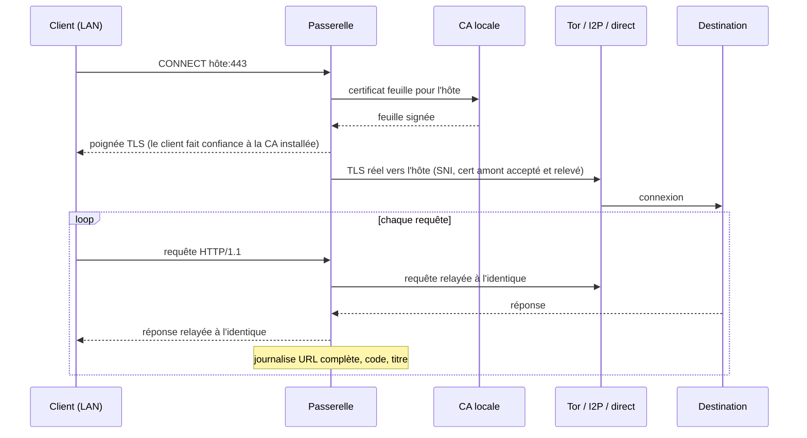

# Interception TLS (« man-in-the-middle »)

Un mode à part, **désactivé par défaut**. Le reste de la passerelle déplace des
octets chiffrés sans les lire ; l'interception fait l'inverse, pour les seuls
hôtes que vous inscrivez explicitement. C'est ce qui transforme le journal
« telle destination a été visitée » en « voici l'URL complète, le code et le
titre de ce qui y a été consulté » — l'apport décisif pour de la veille.

## Comment ça marche

Pour un hôte de la liste blanche, joint en TLS (port 443), la passerelle
n'ouvre plus un tunnel opaque : elle termine le TLS côté client avec un
certificat forgé par une autorité locale, rouvre un TLS vers la vraie
destination, et lit le HTTP/1.1 en clair qui circule entre les deux.

Le trafic est relayé **à l'octet près** — l'en-tête d'origine, le cadrage
`chunked` — l'interception n'altère jamais rien. Seul le contenu déchiffré est
*observé* pour en tirer l'URL, le code et le titre, qui rejoignent le
[Journal](../README.md#pages).

## Mise en place

1. **Ouvrez la page Interception** et téléchargez la CA (`ca.pem`).
2. **Installez-la comme racine de confiance** sur chaque appareil dont vous
   voulez intercepter le trafic (voir l'aide de la page). Comparez l'empreinte
   SHA-256 affichée par le système à celle de l'interface : elles doivent être
   identiques.
3. **Inscrivez les hôtes** à intercepter. Chaque entrée vaut un nom exact
   (`forum.onion`), un suffixe (`.exemple.i2p`) ou un joker de sous-domaines
   (`*.exemple.com`).
4. **Cochez « Intercepter les hôtes listés »** puis enregistrez.

À partir de là, les connexions vers ces hôtes apparaissent dans le Journal avec
leur chemin complet ; partout ailleurs, le trafic reste opaque.

## Ce qu'il faut savoir

- **L'épinglage de certificat casse l'interception.** HSTS, HPKP, et surtout les
  applications mobiles ou clients lourds qui épinglent leur certificat
  refuseront de se connecter. C'est pour cela que la liste est une liste blanche
  explicite, hôte par hôte : la casse ne concerne que ce que vous avez choisi.
- **Le certificat amont n'est pas vérifié**, mais son empreinte est relevée.
  Beaucoup de services cachés présentent un certificat auto-signé, l'adresse
  `.onion` faisant foi à leur place ; les vérifier échouerait. En contrepartie,
  la passerelle mémorise l'empreinte vue par hôte : un changement inattendu sur
  un service surveillé (saisie, clone de phishing, interception tierce) devient
  visible.
- **Seul HTTP/1.1 est analysé.** La passerelle n'annonce que `http/1.1` en ALPN,
  ce qui pousse les clients à retomber dessus. Un flux qui n'est pas du HTTP/1.1
  exploitable est relayé sans être compris, jamais corrompu.
- **La clé de la CA est le secret le plus sensible de la passerelle.** Elle
  vit dans le volume de données (`mitm-ca-key.pem`, permissions `0600`) et n'est
  jamais proposée au téléchargement — seul le certificat public l'est.
- **Régénérer la CA est une rupture.** Toute racine déjà installée cesse d'être
  reconnue : il faut réinstaller la nouvelle sur chaque appareil.

## Où c'est dans le code

- [`src/mitm/ca.rs`](../src/mitm/ca.rs) — autorité locale, certificats feuilles.
- [`src/mitm/http.rs`](../src/mitm/http.rs) — cadrage HTTP/1.1 fidèle.
- [`src/mitm/bridge.rs`](../src/mitm/bridge.rs) — double TLS et boucle de transactions.
- [`src/mitm/mod.rs`](../src/mitm/mod.rs) — état, liste blanche, compteurs.
